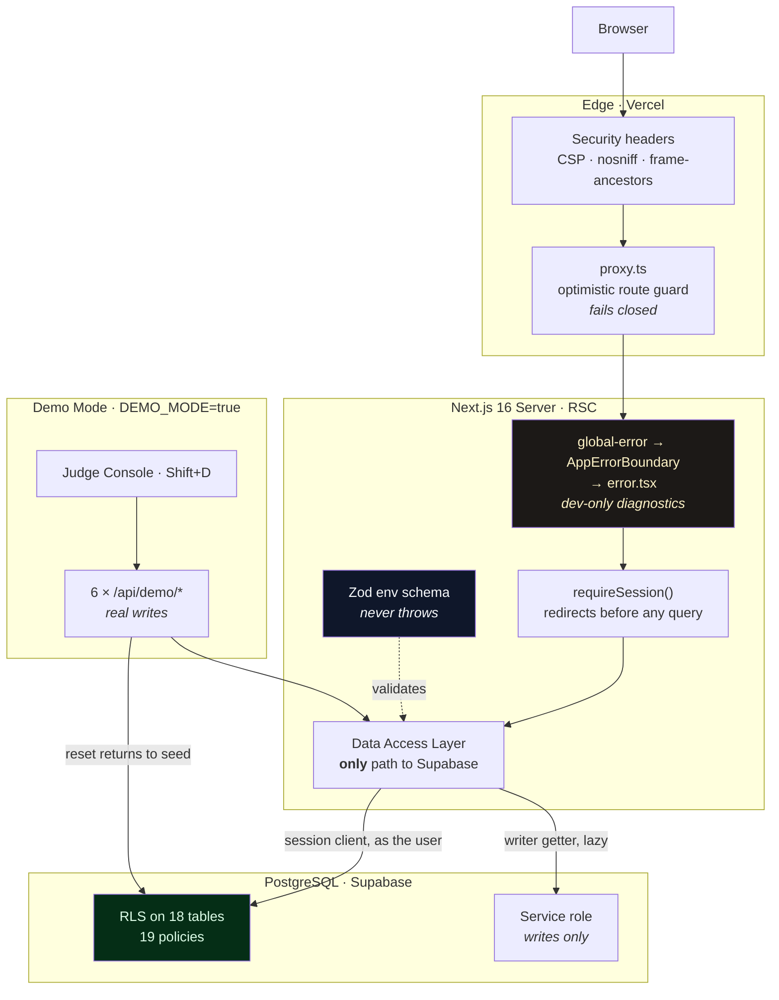

# Buildora

> **Construction site operations in one place.**
> Every worker gets their own shift record by SMS or voice and can confirm or dispute it in
> their own language. What comes back is attendance you can defend at payroll — not a paper
> register you have to trust.

[](https://quorvexhackathon.vercel.app/)
[](https://quorvexhackathon.vercel.app/)
[](https://github.com/Adib-07/Buildora/actions/workflows/ci.yml)
[](https://www.typescriptlang.org/)
[](https://nextjs.org/)
[](https://react.dev/)
[](https://tailwindcss.com/)
[](https://supabase.com/)
[](https://zod.dev/)
[](https://vitest.dev/)

**Stack:** Next.js 16 (App Router, **Turbopack**) · React 19 · TypeScript 5.9 (strict) · Tailwind CSS 4 · Supabase (PostgreSQL + RLS) · Zod 4 · Vitest 5 · GitHub Actions

> **On the toolchain:** this project uses **Next.js with Turbopack**, the bundler Next 16 ships in
> place of webpack. There is no Vite build — the only `vite*` in `package.json` is `vitest`, the
> test runner. There is also no separate client entry point: Next.js App Router renders Server
> Components, so the runtime guards described below live on the server and at the boundary, not in
> a `main.tsx`.

---

## The problem, and how the engineering answers it

Construction attendance fails in the same three places in every country: the register is a
paper book, the SMS replies arrive in three languages nobody on site can read, and a disputed
shift is settled by whoever argues hardest. Payroll runs on the result.

Buildora attacks the failure modes, not just the feature list:

| # | Failure mode | Buildora's answer | Where |
|---|---|---|---|
| 1 | **A missing env var 500s the whole app.** A public landing page that reads the database to decide whether to show "Sign in" turns a config gap into a total outage — *including the sign-in page you need to recover*. | `getSession()` is **total**: it returns `null` instead of throwing, logs the cause, and grants nothing. Fail-closed. Public pages render; protected pages redirect. | [`lib/auth/dal.ts`](lib/auth/dal.ts) |
| 2 | **Config gaps fail silently, or as `TypeError` three layers down.** | A Zod schema is the single description of the environment. `pnpm verify:env` reports **every** gap at once with the exact variable name; misconfigured builds answer `503 DEPENDENCY_DOWN`, not `500`. | [`lib/config/env.ts`](lib/config/env.ts), [`scripts/verify-env.mts`](scripts/verify-env.mts) |
| 3 | **A malformed canonical URL kills the build.** `new URL(env)` in a layout module throws while the layout loads. | `siteUrl()` never throws — bare hosts get `https://`, unparseable values degrade to the default. | [`app/layout.tsx`](app/layout.tsx) |
| 4 | **One bad client component unmounts the tree.** | Three boundary levels: `global-error` → `AppErrorBoundary` (root + authed shell) → per-route `error.tsx`. Diagnostics render **only** when `NODE_ENV === 'development'`. | [`components/error-boundary.tsx`](components/error-boundary.tsx) |
| 5 | **Tenant isolation lives in application code, so one missed check leaks a site's roster.** | **18 tables, 19 RLS policies.** Reads execute *as the signed-in user*, so Postgres refuses a cross-site query even if the code is wrong. `role` and `siteId` come from the `staff` row — never a prop, query string or cookie. | [`supabase/migrations`](supabase/migrations), [`lib/auth/session.ts`](lib/auth/session.ts) |
| 6 | **A demo that fakes its own data collapses the moment a judge clicks.** | Judge Mode drives **real endpoints against the real database**. A persistent **"Demo data"** badge is on screen the whole time. | [`components/judge-console.tsx`](components/judge-console.tsx) |
| 7 | **A secret reaches the browser because of one prefix.** | Only genuinely public vars carry `NEXT_PUBLIC_`. Server secrets are readable from exactly one module, enforced by a test and a post-build bundle scan. | [`tests/security/secrets.test.ts`](tests/security/secrets.test.ts), [`scripts/check-bundle-secrets.sh`](scripts/check-bundle-secrets.sh) |

### A deliberate non-feature

Judge Mode **does not** intercept failed network calls and substitute invented data. That was
considered and rejected, because:

- **401 means unauthorized.** Mocking it shows a signed-out user a populated dashboard and
  bypasses the session guard at the UI layer — a screen no real user can reach.
- **Fabricated data contradicts itself under use.** The moment a judge opens a second screen,
  a mocked dashboard and the real queue behind it disagree.
- **It hides the bug.** If "Lock the day" returns 500, a silent fallback means nobody tells you.

Instead every demo action writes through the production code path, transient failures (429/5xx)
are retried twice, and a real failure is reported. The demo is repeatable because the state is
real.

---

## Key pillars

**1. Resilience by construction.** Configuration is validated, not assumed. `getSession()` cannot
throw. `siteUrl()` cannot throw. Unconfigured deployments render a public site, redirect
protected routes, and answer APIs with a retryable `503`. The failure mode is a degraded but
honest application, never a white screen.

**2. Judge Mode — `Shift + D`.** Jump the simulated clock to shift end, replay a worker reply,
lock the day, reset to the seeded state. All six endpoints are `DEMO_MODE`-gated server-side and
write to the real database, so the demo exercises the code path production uses.

**3. Automated readiness scoring.** A 0–100 shift-readiness score with a weighted breakdown and
ranked next actions. Weights are chosen so a clean attendance board **cannot** mask an untriaged
hazard — safety outranks tidiness. Pure function: `tests/unit/readiness.test.ts`.

**4. One-click export.** The shift report as Markdown — copy, download, or print. Generated on
the server from the caller's own rows, so it cannot drift from what the supervisor is looking at.

---

## System architecture



The load-bearing property is the arrow from `DAL` to `RLS`: **reads run as the signed-in user, so
the database is the boundary, not the application.** Deleting the proxy, or the page-level guard,
loses a redirect — not a tenant boundary.

---

## Certification

> ### 📜 Certificate of Submission
>
> | | |
> |---|---|
> | **Event** | Engineers' Day Inter-College Hackathon 2026 |
> | **Project** | Buildora — construction site attendance, tasks and safety |
> | **Lead Engineer** | **Adib-07** · B.Tech Computer Science & Engineering |
> | **Verification ID** | `ENGDAY-2026-BUILDORA-VERIFIED` |
> | **Deployment Target** | Production — Vercel (`quorvexhackathon.vercel.app`) |
> | **Core Tenet** | Engineering Excellence · Reliability · Fault Tolerance |
>
> **Verification statement.** At the time of submission the repository builds clean under
> `pnpm typecheck`, `pnpm lint`, `pnpm test:unit` (82 passing) and `pnpm build` with zero
> warnings and zero TypeScript errors. The build is gated in CI
> ([`.github/workflows/ci.yml`](.github/workflows/ci.yml)) on every push and pull request.
>
> **Scope of honesty.** The worker-side SMS/voice gateway is modelled in the schema but not yet
> connected to a provider; records are seeded and edited from the supervisor screens. Demo
> deployments carry a persistent "Demo data" badge. Everything asserted in this README is
> verifiable in the repository — nothing here is aspirational.

---

## Quickstart

**Prerequisites:** Node 22 ([.nvmrc](.nvmrc)) · pnpm 11 · Docker (for the local database)

```bash
# 1. Clone
git clone https://github.com/Adib-07/Buildora.git
cd Buildora

# 2. Install (pnpm is pinned in package.json — npm will ignore pnpm-lock.yaml)
pnpm install

# 3. Configure — then fetch the local keys printed by `supabase start`
cp .env.example .env.local

# 4. Database + dev server
supabase start
pnpm db:reset          # applies migrations and seeds two sites
pnpm dev
```

Open **http://localhost:3000**. This project uses port **54421** for local Supabase, not the
54321 default — see [`supabase/config.toml`](supabase/config.toml).

### Environment variables

Only the first two are required to boot. Server secrets must **never** carry a `NEXT_PUBLIC_`
prefix — that would inline them into the browser bundle.

| Variable | Scope | Required | Purpose |
|---|:---:|:---:|---|
| `NEXT_PUBLIC_SUPABASE_URL` | public | ✅ | Supabase project URL (`http://127.0.0.1:54421` locally) |
| `NEXT_PUBLIC_SUPABASE_PUBLISHABLE_KEY` | public | ✅ | Publishable key. Not a secret — RLS is what protects data |
| `SUPABASE_SERVICE_ROLE_KEY` | **server** | writes | Bypasses RLS for rule-enforcing writes. Every write 500s without it |
| `NEXT_PUBLIC_SITE_URL` | public | recommended | Canonical origin for OpenGraph. **Must include the scheme** |
| `DEMO_MODE` | server | — | `true` enables the clock override and `/api/demo/*`. Keep `false` in production |
| `AI_DISABLED` | server | — | `true` forces deterministic fallbacks (no generated narrative) |
| `SMS_ADAPTER` | server | — | `simulator` (default) or `android_gateway` |
| `GATEWAY_USER` / `GATEWAY_PASSWORD` | **server** | — | Basic auth for the SMS gateway |
| `GATEWAY_ALLOWLIST` | **server** | — | Comma-separated E.164 numbers permitted to receive real SMS |
| `WEBHOOK_HMAC_SECRET` | **server** | — | HMAC-SHA256 for inbound gateway webhooks |
| `JOB_SECRET` | **server** | — | Bearer token for `/api/jobs/*` |
| `LOG_LEVEL` | server | — | pino level: `debug` \| `info` \| `warn` \| `error` \| `silent` |

Validate before deploying:

```bash
pnpm verify:env            # reports every missing variable at once
pnpm verify:env --strict   # also rejects DEMO_MODE=true
```

### Scripts

| Script | Purpose |
|---|---|
| `pnpm dev` | Dev server |
| `pnpm build` | Production build |
| `pnpm typecheck` | `next typegen && tsc --noEmit` |
| `pnpm lint` | ESLint |
| `pnpm test:unit` | Unit + secret-scanning suites (no database, ~0.2s) |
| `pnpm test:integration` | API, RLS and contract suites (needs `supabase start`) |
| `pnpm test` | Everything (spawns a dev server — slow) |
| `pnpm verify:env` | Validate the environment |
| `pnpm check:secrets` | Scan the built client bundle for server-only secrets |
| `pnpm check` | typecheck → lint → test → build → secret scan |
| `pnpm db:reset` | Reset and reseed the local database |

---

## Security posture

- **Tenant isolation is enforced by Postgres.** 18 tables, 19 RLS policies. Reads execute as the
  signed-in user; role and site come from the `staff` row, never from client input.
- **Session revalidation.** `getUser()` re-checks the token with the Auth server on every
  request, so a forged or expired cookie cannot produce a session.
- **Non-enumerating responses.** A wrong password and an unknown address are indistinguishable.
  Another site's row returns the *same* 404 as a missing one, so ids cannot be probed.
- **Structured logging with redaction.** Pino redacts phone numbers, message bodies, transcripts
  and auth headers by key name, including nested payloads.
- **Defence in depth.** `proxy.ts` is a convenience redirect. Every protected page also calls
  `requireSession()`, and every query runs through the DAL.
- **No `localStorage` tokens.** Session state is an httpOnly cookie managed by `@supabase/ssr`.

### Not implemented — stated, not stubbed

The SMS/voice gateway pipeline, speech-to-text task drafting, hazard photo upload, and the AI
day-summary narrative. They are modelled in the schema and behind `AI_DISABLED`, so the failure
is deterministic and the surrounding product is demonstrable.

---

## Repository layout

```
app/
  (app)/              authenticated shell — session-guarded
  api/v1/             17 staff routes, Zod-validated
  api/demo/           6 demo routes, DEMO_MODE-gated
  layout.tsx          root layout, font + provider wiring
  global-error.tsx    last-resort boundary
components/
  error-boundary.tsx  client boundary, dev-only diagnostics
  judge-console.tsx   Shift+D demo controls
  readiness-score.tsx 0-100 score with breakdown
  export-report-button.tsx
  ui/                 design-system primitives
lib/
  auth/               session client + DAL
  config/env.ts       Zod env schema — the ONLY place secrets are read
  demo/guard.ts       DEMO_MODE gate
  domain/             attendance · disputes · hazards · tasks · readiness · report
  security/           API wrapper (auth, validation, redaction) + logger
contracts/            Zod schemas shared by client, server and tests
supabase/             18-table schema, RLS policies, seed data
tests/                unit · security · api · db
```

---

## Engineering portfolio — **Adib-07**

| Project | Domain | Highlights |
|---|---|---|
| **Buildora** | Construction operations · full-stack | Multi-tenant SaaS on Postgres RLS; worker-facing SMS UX; release gate in CI |
| **Civic Eye** | Public-safety reporting · full-stack + AI | Field reporting pipeline with AI-assisted triage |
| **IMNCI-SAFE** | Maternal & newborn health · full-stack | IMNCI protocol tracking for frontline health workers |

---

<p align="center">
  <sub>Built for the people standing in the sun holding a phone with one hand — not for a demo reel.</sub>
</p>
